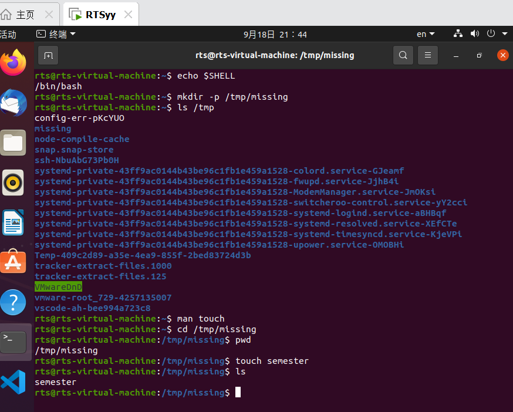
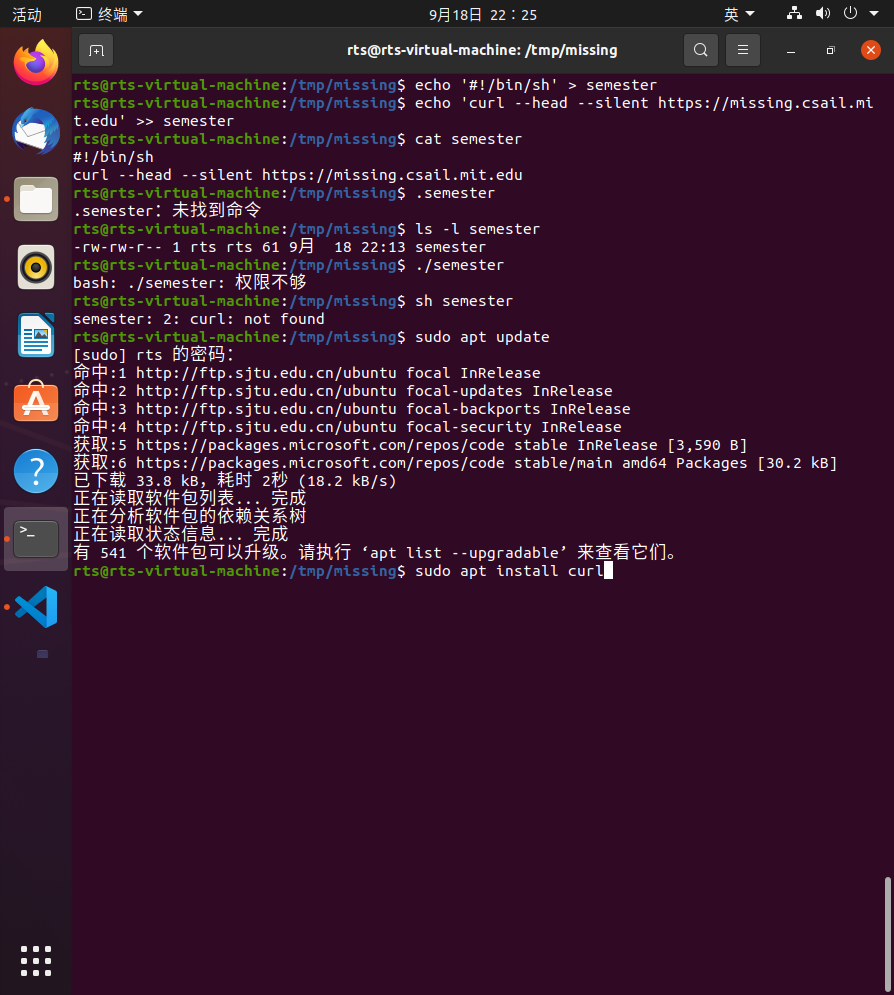
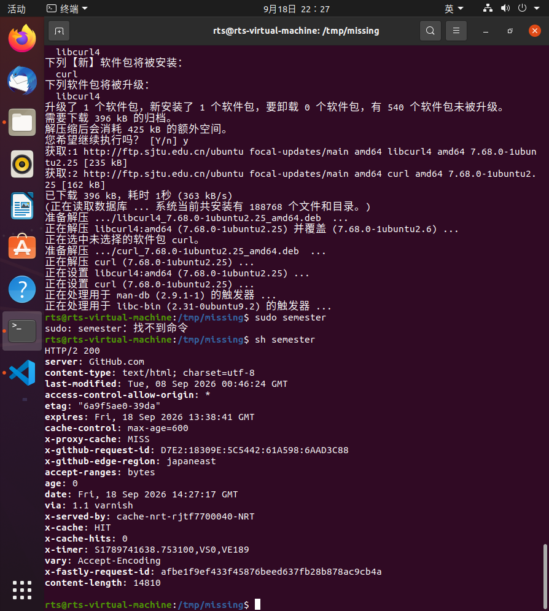
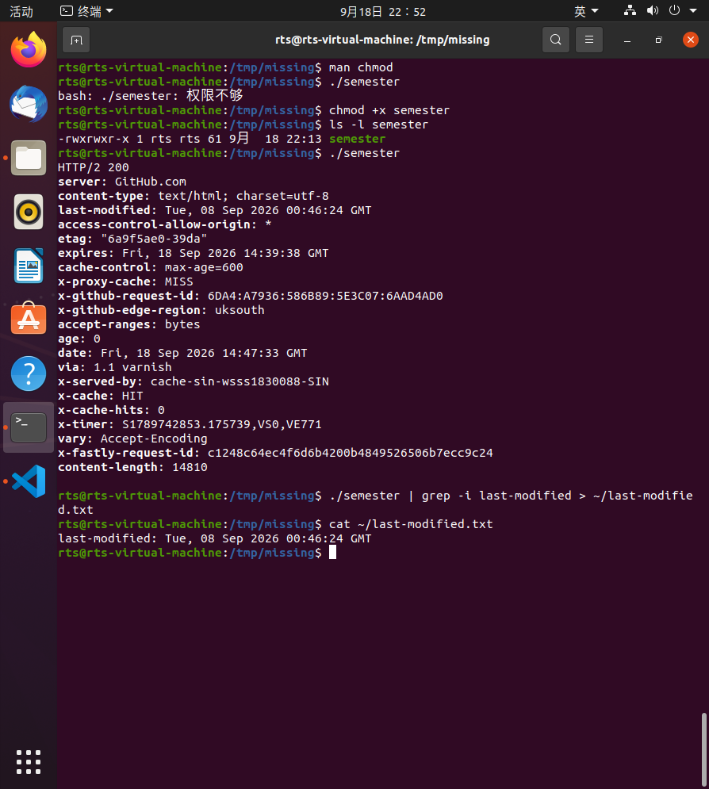

# task 1哈哈哈哈可以说人话了！

## 问题1～4的解答

  第一题的echo是输出的意思，第一题的echo是输出的意思，$SHELL是环境变量，最后可以输出用户使用shell的位置。

  第二题主要是在一个目录下直接建新文件夹。mkdir是make directory，创建目录。
  /tmp/missing是一个绝对路径。/tmp是已经存在的目录，/missing是要创建的文件夹名称。-p写着有保障大概。最后ls加上一个目录位置是列出这个目录下的内容，然后看到了我们的missing。

  第三题是用man这个命令manual，手册来直接系统手册。后面直接接上要查询的命令就可以了。最后按个q就可以退出手册了。

  第四题就是用man直接建文档，先用cd切换到一个目录，ped是打印当前工作目录。在该目录下可以直接建文件，给个名就行。

  ## 问题5～7的解答

  
  

  这一堆题，echo加引号是说把引号里面的内容输出，后面这个大于号是把输出覆盖写入文件。
  两个大于号就是追加写入，cat则是查看文件内容。
  然后就是直接输入文件无法运行，用ls -l加上文件名可以获得该文件的权限包括所有者，同组用户和其他用户。r读，w写，x执行。最后用sh这个程序只需要读取文件内容然后就可以正常运行。

  ## 问题8～10，第11题因为虚拟机不怎么能读到硬件参数就跳过了。

  

  首先阅读了chmod的手册，知道是修改文件权限的命令。
  chmod +x 文件名，就可以成功给该文件增加执行的权限。最后跑通
  接下来是|管道的使用，大概就是把前面的输出作为后面的输入。最后用grep搜索echo运行记录里面带特殊字符串的一行用大于好写入一个用户主目录下新建的。txt文档里，最后cat，结果正确。

