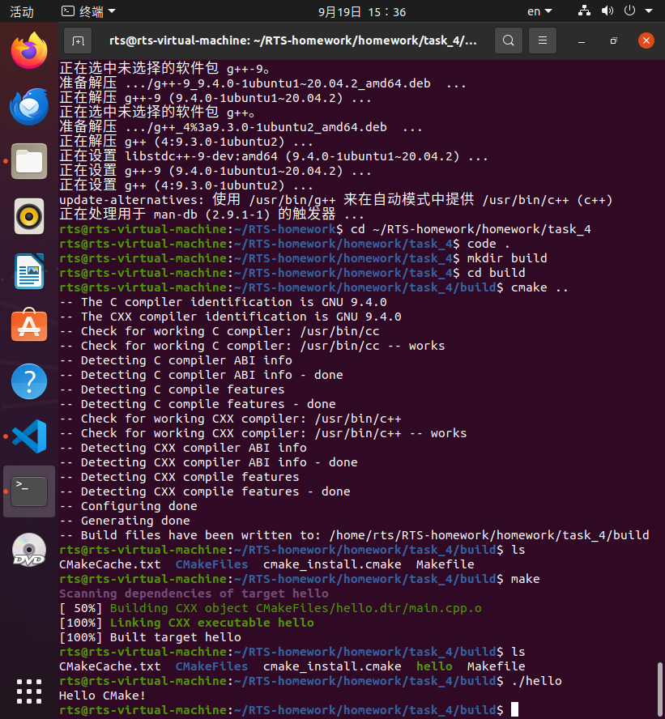

# 任务四的说明

## main.cpp

这是一个很简单输出“Hello CMake！的c++编程，我找ai要的。

## CMakeLists.txt

camke_minimum_required(VERSION 3.10)：最低运行需要CMake 3.10版。

project(Task4):项目名叫Task4

set(CMAKE_CXX_STANDARD 11):要使用c++ 11

add_executable(hello main.cpp):把main.cpp编译成一个叫hello的可执行程序。

### build

CMake 工作产生的中间文件。

#### 截图的具体终端流程解释

mkdir build:新建一个目录

cd build：进入这个目录

cmake ..:cmake发挥作用，生成了编译方案

make：根据前面生成的Makefile调用编译器g++生成一个叫hello的程序。

./hello:执行hello程序

然后就这样吧，没了。

