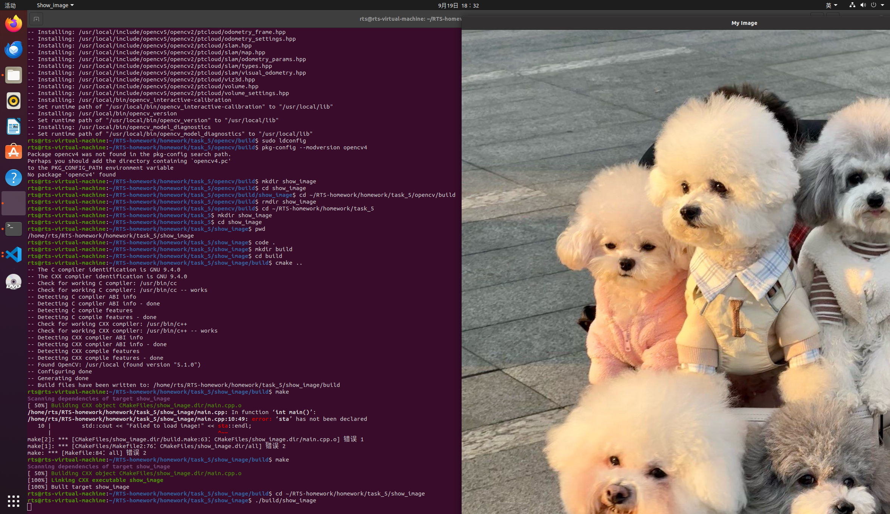

# 任务5的解释文档

*我才发现应该任务4和5一个作业，草率了，没事，任务四说过的我这里就少说点哈！*

## 第一

学会了从源码编译第三方库，就是一种安装的新方法。

## 第二

对比task4，这里的cmake的txt文档里新增加了两个命令：

find_package(XXXX):帮项目找到第三方库

target_link_libraries(show_image ${XXXX}):帮项目需要的库正确连接进来

## 第三

学会了一些c++里OpenCV的语法。

eg：

cv::imread()  读取文件文本

## 最后总结一下

学会了一个比较完整的c++工作流程。

这里有opencv下载时候拉下来的源码，一个c++项目文档，里面包括主文件写明白主程序，还有一个cmake的说明文档，确保程序的正常运行，最后就算我的小图片了。okok，运行截图如下。

